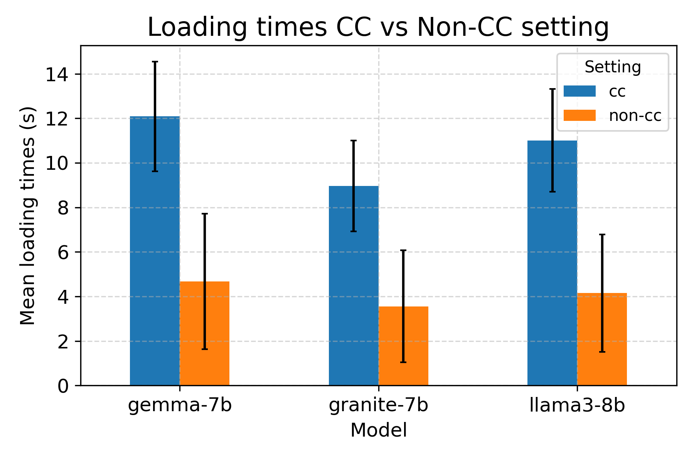
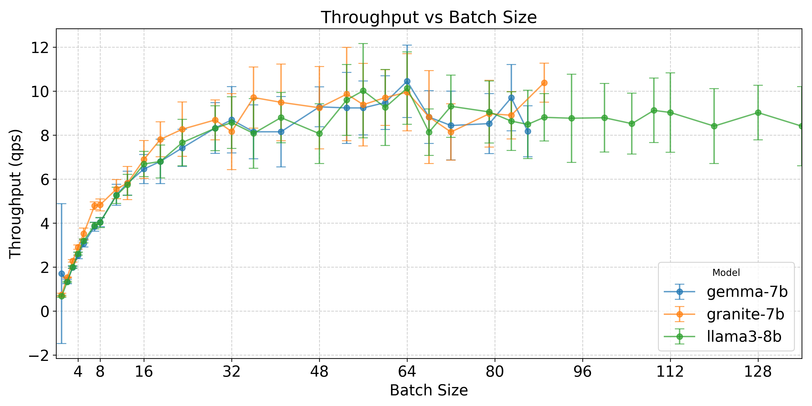

# SINCERE: Scheduling Inference batches in Confidential Environments for Relaxed Executions

The general idea for the project is to study GPU usage on confidential environments, schedule workloads for LLMs and get to evaluate performance metrics such as latency or throughput.

The repository is structured as follows:

├── api_calls.py - script that simulates incoming requests to the server
├── api_scheduler_experiments.py
├── download_models.py
├── generate_workloads_jsonl.py
├── gpu_utilization
│   ├── aaa
├── instructLab_steps.md
├── logs
├── logs_cc
│   ├── aaa
├── logs_noncc
│   ├── aaaa
├── monitor_gpu.sh
├── monitor.py
├── outputs
├── outputs_cc
│   ├── aaa
├── outputs_noncc
│   ├── aaa
├── process_results.ipynb
├── profiling_batch_calls.py
├── profiling_batch_flask.py
├── profiling_models.py
├── profiling_results
│   ├── batch_profiling_results_red_cuda_20240920_181007_ccmode.csv
│   ├── batch_profiling_results_red_cuda_20240924_181459_ccmode.csv
│   ├── batch_profiling_results_red_cuda_20241002_112126_noncc.csv
│   ├── batch_profiling_results_red_cuda_ccmode_grouped.csv
│   ├── model_loading_times_red_cuda_20240906_120028_cc.csv
│   └── model_loading_times_red_cuda_20241002_105724_noncc.csv
├── README.md
├── readme_media
│   ├── aaaa
├── requirements.txt
├── run_experiments.sh
├── run_profiling.sh
├── structure.txt
├── venv
│   ├── aaa
└── workloads
│   ├── aaaa


## Problem Stament

### Initial Problem Statement

Design an end to end strategy to schedule inference workloads with confidential virtual machines in such way that confidentiality is maintained between end user, cloud provider and model developer.

End user: sends a request with a prompt and the model in which it should be processed. Doesn’t want to share information about the data sent to the model developer.

Cloud provider: receives the request from the end user. Owns the scheduler and the confidential VMs. Allows model developers to deploy their models inside a confidential environment.

Model developer: Owns the model and doesn’t want to share information about the model either to the client or the cloud provider.

**Challenges**

Maintain confidentiality inside the cloud server: since the scheduler is owned by the cloud provider we want to avoid leakage of information from the VMs to the scheduler, so the cloud provider is not able to monitor anything regarding the models or the data.

Scheduling strategies can vary depending on the attribute to maximize (throughput, latency, etc).

Handle swapping or removing models if requested.

Optimize batching while meeting deadline requirements.


But we realized that to really understand how we could use current scheduling strategies for the confidential setting we needed to take a step back, and therefore, we moved to a new problem.

### Final Problem Statement

Evaluate the performance of latency, throughput, service level agreements (SLAs) attainment and GPU utilization in a inference server within a confidential and non-confidential environment with NVIDIA H100 GPU under various traffic patterns and scheduling strategies. 

We expect to be able to provide an insight on how confidential and non-confidential scenarios differ when it comes to performing inference with Large Language Models (LLMs). The constraints that surround the problem are that we can only use one Virtual Machine (VM), access one GPU, and load one model at a time, there is therefore a need to control model loading and unloading.

The experiments will simulate different real-world scenarios by varying parameters such as traffic load, traffic distribution patterns, scheduling modes and SLAs.

Details of the system: NVIDIA H100 80GB HBM3 | Driver Version: 550.54.14 | CUDA Version: 12.4 | PyTorch 2.4.0+cu121 | Python 3.12.4

The parameters that will vary over the experiments are:

- **Input Traffic Pattern**: distribution follow by incoming traffic. Traffic distributions studied are:
    - Gamma: traffic with inter-arrival times following a Gamma distribution, representing random arrivals.
    - Bursty: traffic with periods of high activity followed by idle periods, mimicking bursty traffic patterns.
    - Ramp: traffic that gradually increases to a peak and then decreases, representing ramp-up and ramp-down scenarios.

- **Traffic Pattern Mean**: mean requests per second within each traffic pattern. To compare results, we want to deal with different distributions that over time have the same average request arrival.

    

- **SLAs**: Time that can pass before considering that the inference server has not successfully processed the request. The values to explore are 40, 60 and 80 seconds.

- **Scheduling**: the strategies according to which the requests will be batched and processed. The strategies proposed are composed by one or more of the following components 
    - **Logic Components**:
        - “Best Batch”: Wait to fill the batch that yields the maximum throughput for each model, value known after performing the batch profiling.
        - “Timer”:  Adjust the time a batch has to wait before being moved for processing to account for model swapping time, so if the scheduler sees that the latency constraint is going to be violated proceeds to process the batch with its current size, without waiting for the full batch.
        - “Partial Batch”: Process batches that are not full for current loaded model before swapping to another model.
        - “Select Batch”: Select the most appropriate batch size out of a set according to past arrivals and SLA limit. For that we know batch_accumulation_time = batch_size / arrival_rate and then to met SLA batch_accumulation_time <= desired_latency therefore batch_size <= arrival_rate * desired_latency. 

    - **Scheduling Strategies**:
    

Some parameters that have been fixed for this strategies, and that could also be optimize are: (i) the model stay time and the percentage of a batch that has to be filled so it is processed for the "Partial Batch Strategy"; (ii) the timer strategy considers an estimated batch processing time, estimated manually after seeing profiling results, and that timer is also adjusted considering one standard deviation of model loading times; (iii) the estimation for arrival rates in the "Select Batch" strategy. 


## Setup environment

To setup the environment create a new virtual environment where the git repository is located. Python 3.10.12 is recommended

```
git clone https://github.com/yourusername/yourrepository.git
cd sincere
python3 -m venv venv
source venv/bin/activate
pip install -r requirements.txt
```

## Setup Huggingface models and workloads

The models used in this work have been downloaded from Huggingface. To access the models a HuggingfaceToken (read permission) is required and in some cases a previous request for access to the repository containing the model. 

The script to download the models is `download_models.py` and there the token should be defined plus a list of models to download with a model alias and the official model name that can be found at https://huggingface.co/models

In this work **"ibm-granite/granite-7b-base", "google/gemma-7b", "meta-llama/Meta-Llama-3.1-8B"** were the models used with a probability distribution of [0.1,0.3,0.6] respectively (those values are defined in `api_calls.py`), that resembles, to some extent, the frequency of use based on Huggingface downloads for those models. The user can experiment with different distributions of models.

The workload used as input for the models has been generated with instructlab (https://github.com/instructlab) as jsonl files. instructlab use is detailed in `instructLab_steps.md`. Once the jsonl has been created, we use `generate_workloads_jsonl.py` which takes a folder that contains workloads generated with instructlab and outputs a json for each list contained in the jsonl with the following structure:
```
{
    "prompt": "What is an example of a popular tourist destination in Australia that offers unique experiences for visitors?",
    "model_alias": "gpt2-124m"
}
```
The initial version of the script randomly assigns a model out of a list to the prompt. That model will be overwritten later to have more control over the model distribution.

## Run model and batch profiling

Model profiling consists of recording model loading and unloading times, along with their sizes and standard deviations computed over several iterations. `profiling_models.py` is used for those purposes, and it saves the results in the folder `profiling_results` in a csv that starts with `"model_loading_times"`. Those results will be used later for some of the scheduling strategies. The user should edit the list of model to profile, which are define in line 14 of the script. The output file of this step will have to be added to line 104 of `api_scheduler_experiments.py` later on.



Batch profiling consists of performing inference using each model with increasing batch sizes until there is an out of memory error, therefore when the GPU can no longer handle that batch size. During that process a csv containing the columns of model, batch size, processing time, throughput (during inference) and several parameters monitored about cpu and gpu functioning with `monitor.py`. In order to do that we have two scripts: 

(i) `profiling_batch_calls.py` that sends the batches of requests. The batch sizes to try are powers of 2 and several prime numbers.

(ii) `profiling_batch_flask.py` that creates a flask api to receive and process the batches. 

Batch profiling is controlled by `run_profiling.sh`. Within this both scripts are synchronized and the process runs automatically. The user must set a runtime long enough to profile all the batches (up to out of memory) for all models being profiled. 



There one can observe that the higher throughput is given by batches of 64 or similar values.

It is important to mention that for the batch profiling and the following experiments the value for `max_new_tokens` used by the models is set to 50. We have observed that this value is linearly linked to processing time, therefore, for other number of tokens the expected outcome should be different.


## Run experiments

In a similar way to the prior profiling, the experiments are fully controlled by `run_experiments.py`. That script loops over the SLAs values, traffic means and traffic patterns, and scheduling strategies for a given amount of time. Generally, trials will be set to run during 20 minutes (1200 seconds).

The scripts controlled by that are:

(i) `api_calls.py`: A script that simulates incoming requests to the server, following specified traffic patterns and rates.

(ii) `api_scheduler_experiments.py`: A Flask API that handles incoming inference requests, batches them according to specified strategies, and processes them LLMs. The strategies that contain "Timer" make use of model loading times profiled, so in line 104, one must edit the csv path to the appropiate profiling file.

The output for each combination of parameters is a csv named after the parameters and values of the machine where it ran: `outputs/measurements_results_{machine_name}_{device}_{mode}_{distribution}_mean{traffic_mean}_{run_duration}_sla{batch_time_limit}_{timestamp}.csv`. That csv will contain a row for each request processed, timestamps for arrival and inference, model used, batch size (meaning that the request was processed along with other requests in a batch of that size), latency of the request in seconds (time from arrival to response after inference), batch processing time in seconds, throughput during inference as queries per second (throughput measured as batch size divided by processing time), and cpu and gpu information gathered with `monitor.py`. Along to the csv, a log file is also produced, `logs/batch_processing_debug_{machine_name}_{device}_{mode}_{distribution}_mean{traffic_mean}_{run_duration}_sla{batch_time_limit}_{timestamp}.log`, to keep track of the requests that have been processed, model switches, total runtime, inference time, and more useful information.

To differenciate between runs with confidential and non-confidential modes, move the results to the folders `outputs_cc`, `outputs_noncc` and same with logs.

## Process results

Results of prior sections are aggregated and visualized in the `processing_results.ipynb` notebook:

- Batch profiling: results are aggregated grouping by model and batch size, and additional columns are defined such as standard deviations for various values. With that aggregated data we plot "Throughput vs Batch Size", already shown above.

- Input patterns: plots for input patters are also plotted there. Within those plots we manually adjust the parameters of each pattern to obtain the desired mean and make sure that this value is similar between them.

- **Result analysis**: all the csvs and logs files are read and matched. A dataframe is created for each csv and the filename metadata (machine, device, scheduling strategy, traffic pattern, traffic mean, and sla) is added to the dataframe as well as switch count, total time, total inference time, inference time percentage from the logs. With those values we define more columns to account for overall throughput (total requests processed / total time), inference throughput (total requests processed / total inference time), and SLA attainment (percentage of requests with latency < SLA limit). Once we have all that data, we can group as desired to obtain representations of interest.
